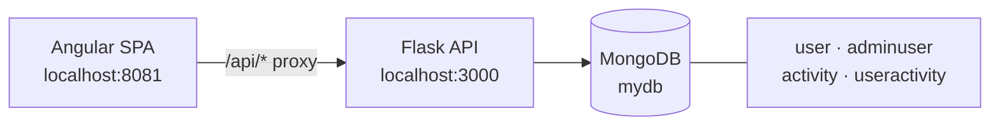

# School Rewards API

REST API for a student activity rewards program: students enroll in school events, staff verify attendance, and points roll up into a live leaderboard. Built with **Python + Flask + MongoDB**.

This is the backend. The Angular frontend lives in **[school-rewards-web](https://github.com/yinbri/school-rewards-web)**.

<sub>Built in grade 11 (Feb–Mar 2023) as my first REST API — see [Notes on the code](#notes-on-the-code) for an honest read on what I'd do differently now.</sub>

---

## What it does

A school runs events — fundraisers, math circle, DECA club — each worth points. The API models the full lifecycle:

1. A student signs up and sees the events they're eligible for.
2. Enrolling in an event banks **pending** points.
3. An administrator marks attendance, converting pending points to **earned** points.
4. A MongoDB aggregation ranks students by total points for the leaderboard.

Two separate actors are supported: students (`user`) and staff (`adminuser`), each with their own login endpoint and their own set of routes.

---

## Architecture



The Angular dev server proxies every `/api/*` request to Flask, so the browser sees a single origin and there's no CORS configuration to manage.

---

## Data model

| Collection | Purpose | Shape |
|---|---|---|
| `user` | Student accounts | `{ username, password }` |
| `adminuser` | Staff accounts | `{ username, password }` |
| `activity` | Event catalogue | `{ id, date, place, description, points }` |
| `useractivity` | A student's relationship to an event | `{ username, id, date, place, description, points, status }` |

`useractivity.status` is the state machine that drives the whole app:

```
Unenrolled ──enroll──> Enrolled ──admin verifies──> Attended
     ^                     │
     └──────unenroll───────┘
```

`Enrolled` counts toward **pending** points; `Attended` counts toward **earned** points.

---

## API reference

All endpoints return JSON with a `status` field of `"success"` or `"failed"`.

| Method | Endpoint | Used by | Description |
|---|---|---|---|
| `POST` | `/login_service` | Student | Authenticate a student account |
| `POST` | `/enrollment_service` | Student | Create a new student account |
| `POST` | `/eligible_activity_service` | Student | List events a student can join, annotated with their current status |
| `POST` | `/rewards_activity_service` | Student | A student's events plus `total_earned` and `total_pending` |
| `POST` | `/update_enrollment_service` | Both | Move an event between `Enrolled` / `Attended` / `Unenrolled` |
| `POST` | `/admin_login_service` | Admin | Authenticate a staff account |
| `POST` | `/pending_user_activities_service` | Admin | Every student's activity records, for verification |
| `GET` | `/leader_board_service` | Public | Students ranked by total points |

### Example

```bash
curl -X POST http://localhost:3000/rewards_activity_service \
  -H 'Content-Type: application/json' \
  -d '{"username": "brian@gmail.com"}'
```

```json
{
  "status": "success",
  "total_earned": 300,
  "total_pending": 200,
  "useractivities": [
    {
      "username": "brian@gmail.com",
      "id": "1001",
      "date": "2023-01-05",
      "place": "Math Building",
      "description": "Math circle event.",
      "points": 200,
      "status": "Enrolled"
    }
  ]
}
```

### Status transitions

```bash
curl -X POST http://localhost:3000/update_enrollment_service \
  -H 'Content-Type: application/json' \
  -d '{
    "username": "brian@gmail.com",
    "rowvalue": {
      "id": "1001", "date": "2023-01-05", "place": "Math Building",
      "description": "Math circle event.", "points": 200, "status": "Attended"
    }
  }'
```

---

## Running it locally

**Prerequisites:** Python 3.9+, and MongoDB running on `localhost:27017` ([community edition](https://www.mongodb.com/try/download/community)).

```bash
git clone https://github.com/yinbri/school-rewards-api.git
cd school-rewards-api

python3 -m venv .venv && source .venv/bin/activate   # Windows: .venv\Scripts\activate
pip install -r requirements.txt
```

Seed the database with sample students, staff, and events:

```bash
mongosh db/dbscript.js
```

Start the API on port 3000 — the port the Angular proxy expects:

```bash
flask run -h localhost -p 3000
```

Verify:

```bash
curl http://localhost:3000/leader_board_service
```

### Seeded accounts

| Role | Username | Password |
|---|---|---|
| Student | `brian@gmail.com` | `test` |
| Student | `kevin@gmail.com` | `test` |
| Admin | `admin` | `admin` |

Also seeded: 4 student accounts and 8 events worth 100–800 points each.

---

## Project structure

```
.
├── app.py                # All routes and MongoDB access
├── db/dbscript.js        # mongosh seed script
└── requirements.txt
```

---

## Notes on the code

This was my first REST API, written for a high school project, and I've deliberately left it as it was rather than quietly modernising it. Things I'd do differently today:

- **Passwords are stored and compared in plaintext.** Real accounts would need hashing (bcrypt/argon2) and session tokens instead of an authenticated flag held client-side.
- **Every request opens its own `MongoClient`.** PyMongo's client is designed to be created once and shared — the connection pool is wasted here.
- **All routes live in one `app.py`.** Flask blueprints and a data-access layer would separate transport from persistence.
- **No input validation or automated tests.** Malformed payloads raise unhandled exceptions rather than returning a 4xx.
- **Status codes are always 200**, with success signalled in the body. Real HTTP semantics (401, 404, 409) would be better.

What it does demonstrate: designing an API around a clear domain model, a two-actor permission split, MongoDB aggregation pipelines, and shipping a working frontend against my own backend contract.

---

## License

MIT — see [LICENSE](LICENSE).
